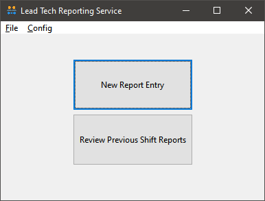
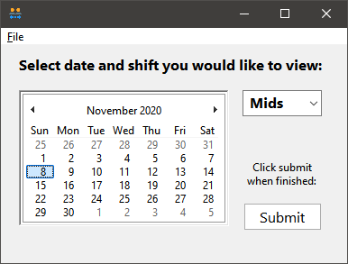
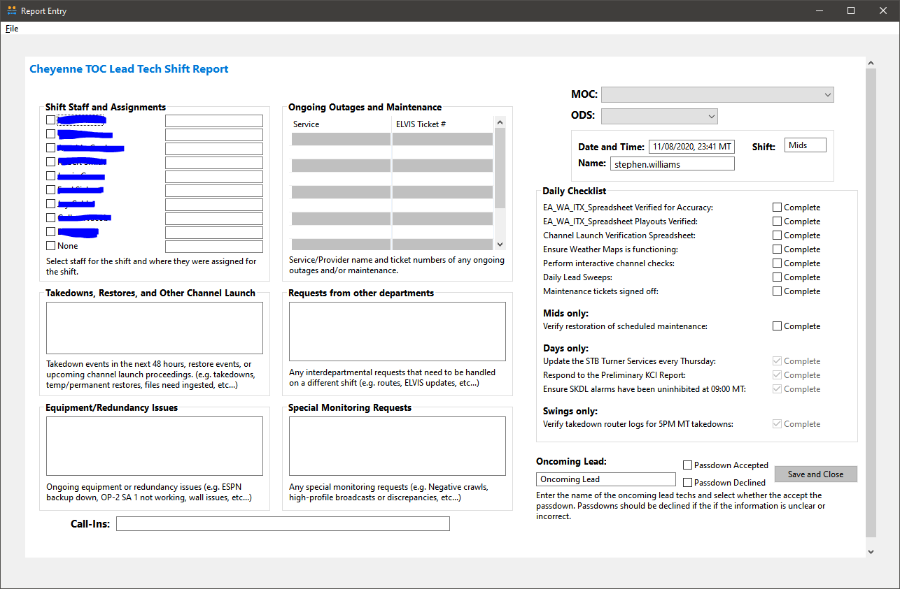

  
# I'm still in school, so I'm mostly just testing, researching, and trying to build a decent portfolio.  
I have been working full time to support my family since the moment I enrolled in college to pursue my AS and BS in Computer Science. Which, quite unfortunately, has precluded
me from pursuing an internship as a software dev. I would be completely willing to quit my job and take a pay cut in order to work an internship so I could gain some incredibly
valuable experience, but there is a distinct lack of options in Wyoming and I will not be able to leave the state for a little while yet.  

### But, I have been working on little project at my current job...  

# This is the Lead Tech Shift Report  

### Affectionately known as LeTeRS  

This 'Lead Tech Shift Report' program was designed and implemented as a way of communicating important information between shifts.
I was not able to implement a proper database backend due to network and system permissions
So, I implemented a simple "datastore" that essentially stores everything in a long string that is delimited by "--;".
I plan to continue exploring options for this data storage methodology, and any suggestions would be appreciated!  
 
**(Update...)** I hated the hacky "datastore" I implemented to store data! So, now that the semester is over and I have a break until January, I'm researching and will be (hopefully soon)
implementing a HyperSQL DB to store the passdown data. This should be a much more efficient, secure, and reliable method of persistent data storage and retrieval. I should also be
able to adjust other aspects of the backend to allow the non-software savvy coworkers/management that I built it for the ability to easily adjust the checklist and staff lists. The staff
list is easy enough right now, but I want to add the ability to adjust it for a single day in the event an employee from another shift switches shifts or works overtime to support a shift
that is lacking staff (which is a big issue right now because we lost a lot of people and we're short staffed for day and swing shift).

## The Main Screen   
A simple window to allow the user to select what they intend to do with a file menu for easy access to configuration files.  

## The Date Selection Window  
This is the first window seen if the user selects 'Review Previous Shift Reports'.  

## The Shift Report Entry Window
This window is the heart of the program. Technicians are able to effectively communicate any important shift information through this window. Once the oncoming lead has reviewed and accepted the passdown, pressing 'Save and Close' will create an HTML email in Outlook that can be sent to anyone that needs to see it.

### By the way, I will be graduating in May of 2021 and will be willing and able to accept a software developer position immediately after.
